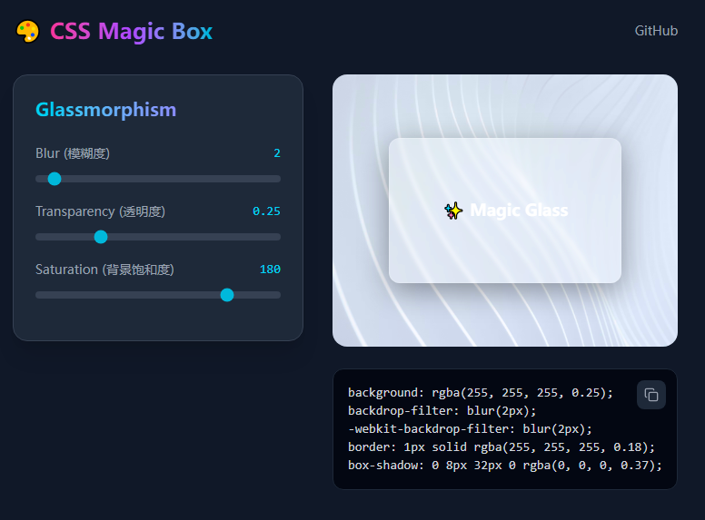

<div align="center">

  # 🎨 CSS Magic Box

  **A collection of aesthetic CSS generators for modern web design.**
  <br>
  **为现代 Web 设计打造的唯美 CSS 生成器集合**

  [](LICENSE)
  
  
  

  <br>

  [**xr-arrow-right: Live Demo / 在线体验**](https://css-magic-box.vercel.app/)
  
  <br>
</div>

---



## ✨ Introduction (简介)

**CSS Magic Box** is a developer-friendly tool designed to generate complex CSS effects instantly. Stop writing repetitive CSS by hand—visualize your design and get the code in one click.

**CSS Magic Box** 是一个对开发者友好的工具，旨在瞬间生成复杂的 CSS 效果。停止手写重复的 CSS 代码——可视化你的设计，一键获取代码。

Current generators include:
- **🔮 Glassmorphism (毛玻璃)**: Customize blur, transparency, and saturation.

## 🚀 Features (功能亮点)

* **Real-time Preview (实时预览)**: See changes instantly as you tweak the sliders.
* **One-click Copy (一键复制)**: Get production-ready CSS code immediately.
* **Modern UI (现代界面)**: Built with a dark-themed, clean interface for focus.
* **Highly Customizable (高度定制)**: Control every aspect of the effect (Blur, Opacity, Saturation, etc.).

## 🛠️ Tech Stack (技术栈)

* **Core:** [React 19](https://react.dev/)
* **Styling:** [Tailwind CSS 4](https://tailwindcss.com/)
* **Icons:** [Lucide React](https://lucide.dev/)
* **Build Tool:** [Vite](https://vitejs.dev/)

## 📦 Getting Started (快速开始)

Make sure you have [Node.js](https://nodejs.org/) installed.

1.  **Clone the repository**
    ```bash
    git clone [https://github.com/xingchengzhu/css-magic-box.git](https://github.com/xingchengzhu/css-magic-box.git)
    cd css-magic-box
    ```

2.  **Install dependencies**
    ```bash
    npm install
    ```

3.  **Run development server**
    ```bash
    npm run dev
    ```

4.  Open `http://localhost:5173` in your browser.

## 🗺️ Roadmap (开发计划)

We are constantly adding new generators! Upcoming features:

- [x] **Glassmorphism Generator** (Released)
- [ ] **Neumorphism Generator** (Soft UI buttons & inputs)
- [ ] **Fancy Border-Radius** (Organic shapes)
- [ ] **Box-Shadow Layering** (Smooth, multi-layer shadows)
- [ ] **Gradient Text Generator**


## 📄 License

Distributed under the MIT License. See `LICENSE` for more information.

---

<div align="center">
  <sub>Built with ❤️ by <a href="https://github.com/xingchengzhu">Xingcheng Zhu</a></sub>
</div>