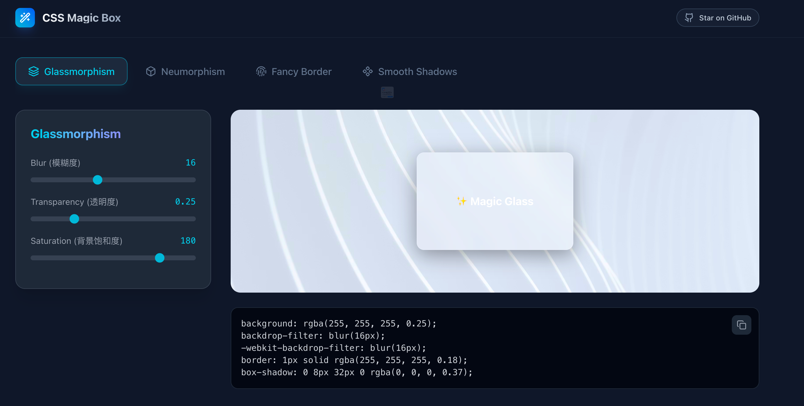
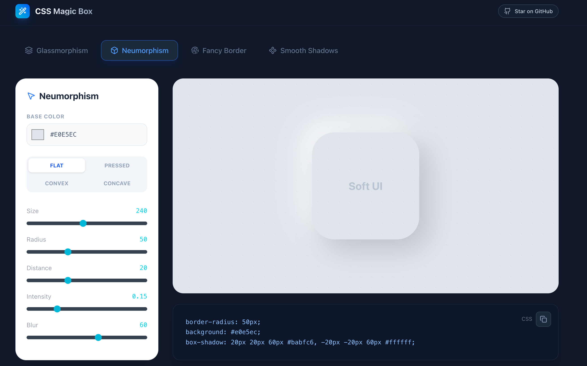
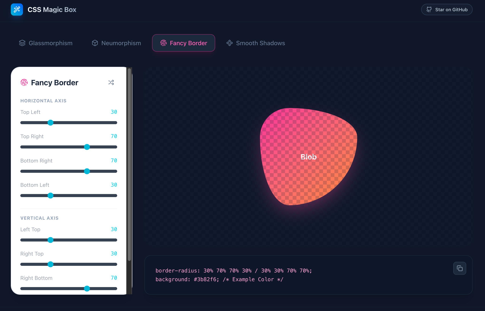
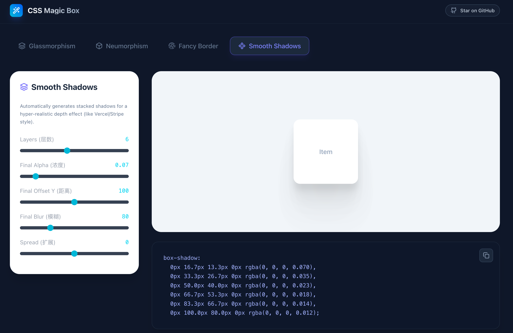

<div align="center">

  # 🎨 CSS Magic Box

  **The Ultimate CSS Generator Collection for Modern Web Design.**
  <br>
  **现代 Web 设计的终极 CSS 生成器集合**

  [](LICENSE)
  
  
  

  <br>

  [**🚀 Live Demo / 在线体验**](https://css-magic-box.vercel.app)
  
  <br>
</div>

---

## ✨ Introduction (简介)

**CSS Magic Box** is a developer-first tool designed to generate complex, trendy CSS effects instantly. Stop struggling with `box-shadow` calculations or `border-radius` values—visualize your design and get the production-ready code in one click.

**CSS Magic Box** 是一款专为开发者设计的工具，旨在瞬间生成复杂且时髦的 CSS 效果。停止纠结于复杂的阴影计算或圆角数值——可视化你的设计，一键获取生产级代码。

## 🚀 Generators (功能列表)

We currently provide 4 powerful generators:

### 1. 🔮 Glassmorphism (毛玻璃)
Create the trendy frosted glass effect with adjustable blur, transparency, and saturation.


### 2. 🖱️ Neumorphism (新拟态)
Generate Soft UI elements with realistic light and dark shadows. Supports Flat, Pressed, Convex, and Concave shapes.


### 3. 🧬 Fancy Border (流动边框)
Design organic, blob-like shapes using 8-point `border-radius` values. Great for profile avatars and hero sections.


### 4. 🌫️ Smooth Shadows (平滑阴影)
Automatically layer multiple shadows to create a hyper-realistic depth effect (similar to Vercel/Stripe style), far superior to a single box-shadow


## 🛠️ Tech Stack (技术栈)

* **Core:** [React 19](https://react.dev/)
* **Styling:** [Tailwind CSS 4](https://tailwindcss.com/)
* **Icons:** [Lucide React](https://lucide.dev/)
* **Build Tool:** [Vite](https://vitejs.dev/)

## 📦 Getting Started (快速开始)

Make sure you have [Node.js](https://nodejs.org/) installed.

1.  **Clone the repository**
    ```bash
    git clone [https://github.com/xingchengzhu/css-magic-box.git](https://github.com/xingchengzhu/css-magic-box.git)
    cd css-magic-box
    ```

2.  **Install dependencies**
    ```bash
    npm install
    ```

3.  **Run development server**
    ```bash
    npm run dev
    ```

4.  Open `http://localhost:5173` in your browser.


## 📄 License

Distributed under the MIT License. See `LICENSE` for more information.

---

<div align="center">
  <sub>Built with ❤️ by <a href="https://github.com/xingchengzhu">Your Name</a></sub>
</div>